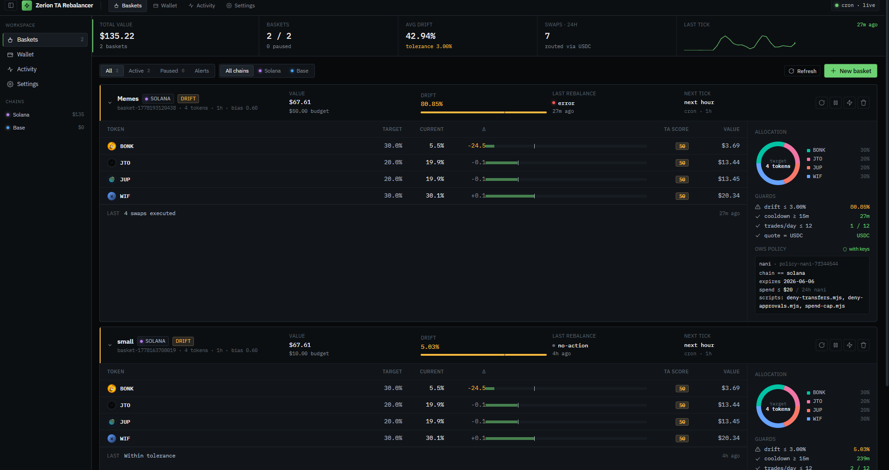
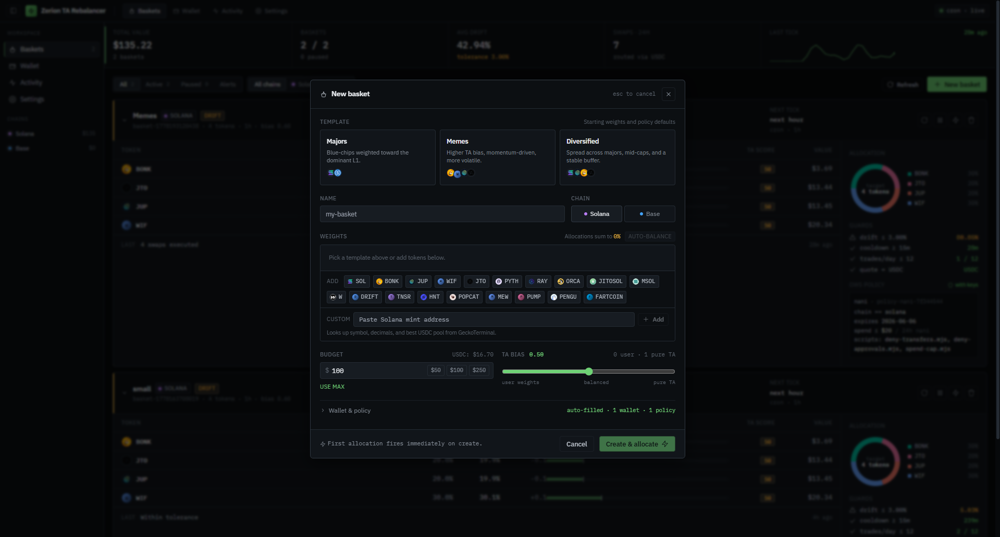
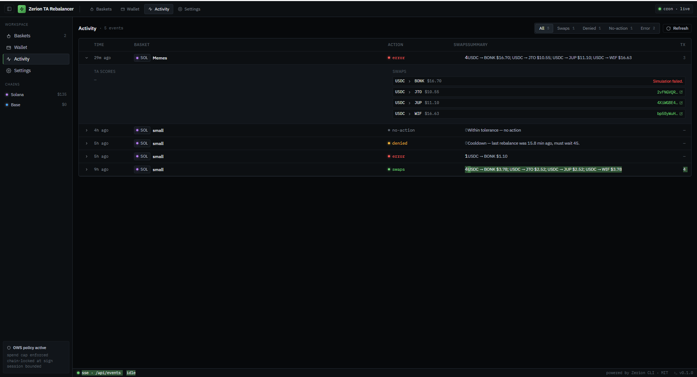
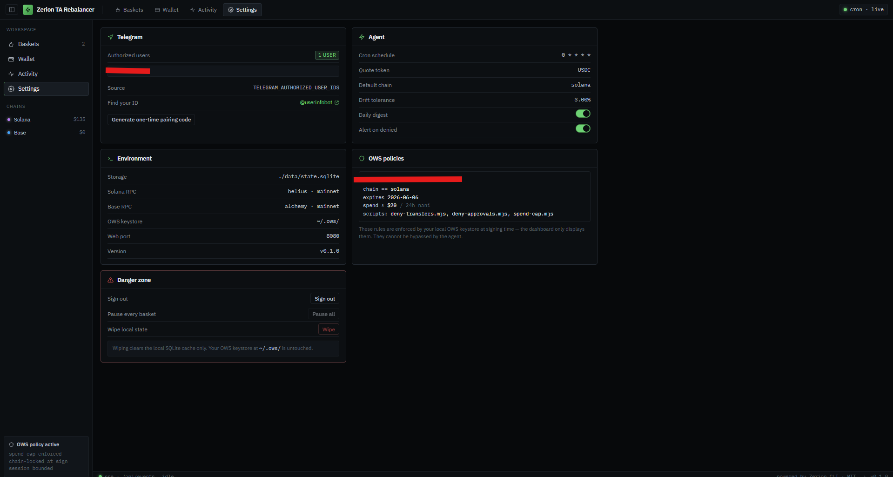

# Zerion TA Rebalancer

**Self-hosted, policy-bounded crypto portfolio rebalancer. Runs on your laptop or VPS. Talks to you in plain English.**

Set up a basket of tokens once. The rebalancer holds them at the weights you set, and every hour quietly nudges allocations based on technical signals — RSI, MACD, EMA, ATR, volume. You can ask it questions, pause it, override it. It cannot lose your funds outside the limits you set, because the wallet itself refuses to sign anything outside your policy.

  

---

## Screens

| Dashboard home — stats strip + baskets list | Expanded basket — TA scores, allocation donut, live OWS policy |
|:---:|:---:|
|  |  |

| Activity — every tick with TA scores + tx hashes | Settings — Telegram, agent, environment, policies |
|:---:|:---:|
|  |  |

---

## Why use it

Most "auto-rebalancing" tools are custodial — you give a company control of your funds. This is the opposite:

- **Your keys, your machine.** The wallet's encrypted keystore lives on your hard drive (or VPS). No third-party custody.
- **The bot can't go rogue.** Even if the rebalancer code is hacked tomorrow, the agent token can only do what the wallet's policy allows. Wrong chain → refused. Native transfer → refused. Over the daily transaction cap → refused.
- **No subscription, no fees beyond gas.** Self-host, free forever. (Zerion's API has a free tier; the rest is your laptop's electricity.)
- **Real transparency.** Read the source. Watch the cron tick. Ask the agent why it did what it did. No black box.

## Who this is for

| You are | What you'll get |
|---|---|
| A long-term crypto holder tired of manually rebalancing | Hourly automation, hands-off |
| A trader who wants TA-driven allocation but not a bot you can't audit | Open source, deterministic math, plain-English reasoning |
| A developer who wants to extend an autonomous on-chain agent | Hackable in TypeScript, every layer is a separate file |
| A privacy-minded user who refuses cloud custody | Single binary on your hardware, no telemetry |

## How it works in 30 seconds

1. **Setup wizard** runs once. Creates an encrypted wallet, mints a scoped agent token, attaches a tight policy (chain-locked, no transfers, no approvals, daily transaction cap).
2. **You fund the wallet** with a small amount of USDC + native gas.
3. **You define a basket** in the web dashboard: which tokens, what initial weights, how much to follow TA vs your bias.
4. **First allocation fires immediately.** The dashboard streams a staged animation (queued → quoting → signing → swapping → settling → done) as the basket fills up.
5. **Cron fires every hour after.** The rebalancer fetches OHLCV from GeckoTerminal, computes a composite TA score per token, proposes new weights, runs guard checks, and routes any approved swaps through the Zerion API. The Claude agent narrates each decision in plain English.
6. **You watch it work** in the web dashboard or chat with it on Telegram.

## What's in the box

- **Web dashboard** with a Bloomberg-terminal-density layout: top stats strip, expanded basket cards (token table, allocation donut, guards, live policy panel), per-tab Wallet / Activity / Settings.
- **Telegram bot** — push notifications + free-form chat backed by the Claude Agent SDK with read-only tools.
- **Voice + LCD frontend (optional)** — a Raspberry Pi 3B with a mic, speaker, and small LCD can run [voice/](./voice/) as a talking, animated-face assistant. Say "Hey Bablu, create a basket called Demo on Solana with SOL and USDC, budget five dollars" and watch the dashboard update live. Uses your existing Claude Code subscription on the main box — no extra LLM bill.
- **Hourly cron** — every basket gets a tick. Decisions are logged to SQLite with full TA scores and tx hashes.
- **Curated token registry** — 17 Solana defaults (SOL/JUP/JTO/WIF/BONK/PYTH/RAY/ORCA/JITOSOL/MSOL/W/DRIFT/TNSR/HNT/POPCAT/MEW/PUMP/PENGU/FARTCOIN) and 11 Base defaults (ETH/AERO/DEGEN/BRETT/CBBTC/VIRTUAL/TOSHI/HIGHER/KEYCAT/MOG/PRIME).
- **Custom tokens** — paste any Solana mint or Base contract address; resolves symbol, decimals, and the deepest USDC pool from GeckoTerminal, persists for future baskets.
- **Live policy display** — the dashboard reads each basket's actual rules from your local OWS keystore (chain lock, expiry, daily spend cap, attached scripts). Not the app's *view* of the policy — the rules the keystore will actually enforce.

## Three layers of policy — why it's safe

The agent can't bypass any of these. They run independently and AND together:

| Layer | Where | Stops |
|---|---|---|
| **OWS built-in (cryptographic)** | Wallet signing layer (Rust binding) | Wrong chain · Wrong token · Native transfers · ERC-20 approvals · Post-expiry signing |
| **OWS executable (`spend-cap.mjs`)** | Script run inside the OWS dispatcher | More than N transactions per 24h |
| **App-layer guards** | Backend code in `src/core/policy.ts` | Drift > 10% per tick · Cooldown < 45 min · Slippage > 2% · Dust swaps |

Even if a hacker stole your agent token from disk and replaced our code with their own, the wallet still refuses to sign anything outside layer 1 + 2. Read [docs/POLICY.md](./docs/POLICY.md) for the full breakdown.

## Setup

> **Windows users:** the underlying [Zerion CLI](https://github.com/zeriontech/zerion-ai) ships native Linux/macOS binaries only. Run inside WSL2 (Ubuntu) — same files, same commands.

### Prerequisites

- **Node.js 22+** ([install via nvm](https://github.com/nvm-sh/nvm))
- **A Zerion API key** — free tier is enough. Sign up: [dashboard.zerion.io](https://dashboard.zerion.io)
- **One of these for the agent** (chat + reasoning):
  - **Claude Code subscription** (Pro/Team/Max). The Claude Agent SDK runs as a subprocess of the `claude` CLI and reuses your subscription credentials — no per-token billing. **Two steps required**:
    ```bash
    npm install -g @anthropic-ai/claude-code   # installs the `claude` CLI globally
    claude login                                # signs in with your Pro/Team/Max account
    ```
    > Without these, just installing the npm `@anthropic-ai/claude-agent-sdk` package is not enough — the SDK spawns the `claude` CLI to talk to Anthropic, so it must be globally available and logged in.
  - **Anthropic API key** from [console.anthropic.com](https://console.anthropic.com) — direct per-token billing. Set `ANTHROPIC_API_KEY` in `.env`. No `claude` CLI install needed.
  - **Neither** — agent reasoning is disabled but TA-driven rebalancing still works (cron fires deterministic swaps; Telegram bot answers `/balance` and `/status` but not natural-language chat).
- **Optional: Telegram bot token** from [@BotFather](https://t.me/BotFather) for chat + push notifications. Plus your Telegram user ID (find via [@userinfobot](https://t.me/userinfobot)) to put in `TELEGRAM_AUTHORIZED_USER_IDS`.

### Install

```bash
# 1. Clone this repo and the forked Zerion CLI as siblings
git clone https://github.com/Magicianhax/zerion-ta-rebalancer.git
git clone https://github.com/Magicianhax/zerion-ai.git

cd zerion-ta-rebalancer

# 2. Configure
cp .env.example .env
# Edit .env: set ZERION_API_KEY and ADMIN_PASSWORD (8+ chars).
# If using API key auth, also set ANTHROPIC_API_KEY.
# If using Claude Code subscription, leave ANTHROPIC_API_KEY empty.

# 3. Install the forked CLI's dependencies
cd ../zerion-ai && npm install --legacy-peer-deps && cd ../zerion-ta-rebalancer

# 4. Install rebalancer dependencies (this also builds the web dashboard)
npm install --legacy-peer-deps
npm run build
```

> **Note on `--legacy-peer-deps`:** the Claude Agent SDK declares `zod ^4` as a peer dependency, but our API routes use `zod 3` syntax. The SDK works fine on `zod 3` at runtime; we ship a project-level `.npmrc` so the flag is permanent.

### Run the setup wizard

One-time step that creates your wallet, policy, and agent token:

```bash
npm run setup
```

The wizard will:

1. **Create an encrypted wallet.** You choose a passphrase. **Write it down on paper before pressing Enter.** OWS encrypts the keystore with this passphrase; there is no recovery without it.
2. **Create a policy.** Default settings are sensible: chain-locked to Solana (or Base), 8-20 swaps per 24 hours, 30-day expiry. You can override any of these.
3. **Mint an agent token.** The token is bound to your wallet and the policy. It's what the rebalancer uses to sign — never the master passphrase.
4. **Show your recovery phrase.** **Write down the 12 words on paper.** This is the only true backup. The mnemonic works in MetaMask, Phantom, and any other BIP-39 wallet.
5. **Show your deposit address.** Send a small amount of USDC + native gas (SOL or ETH) here.

### Fund the wallet

```bash
node ../zerion-ai/cli/zerion.js wallet fund --wallet <name>
```

Sensible starting amounts:

- **Solana:** 10–50 USDC + 0.1 SOL for fees
- **Base:** 10–50 USDC + ~$2 worth of ETH for fees

You can run with as little as $5; the rebalancer handles dust thresholds gracefully and skips trades below $1.

### Boot

```bash
npm start
```

You'll see:

```
Zerion TA Rebalancer ready
  → Web dashboard: http://localhost:3000
  → Cron schedule: 0 * * * *
  → Telegram bot:  running
```

### Use it

**Web dashboard** — open `http://localhost:3000` (or whatever `PORT` you set), log in with `ADMIN_PASSWORD`. Click **New basket**, walk the form, hit **Create & allocate**. Watch the staged "first allocation in flight" toast as the basket fills up.

**Telegram** — open the chat with your bot:

| Command | What it does |
|---|---|
| `/start <pairing-code>` | Bind this chat (generate code in dashboard Settings) |
| `/status` | One-line per basket — chain, budget, active/paused |
| `/balance` | Live USD value per basket, broken down by token |
| `/pause <basket>` / `/resume <basket>` | Toggle a basket |
| `/reset` | Clear chat history with the agent |
| Anything else (plain text) | Talks to the Claude agent — ask anything |

Examples of plain-text questions you can ask:

- *"how is my Solana basket doing?"*
- *"why did you sell BONK yesterday?"*
- *"what's the TA say about JUP right now?"*
- *"should I add USDC?"*
- *"pause the basket — I'm worried about the market"*

The agent uses real tools to look up live data; it doesn't guess.

## Run on a VPS

Same install steps as laptop. For HTTPS, put a reverse proxy in front:

**Caddyfile** (the simplest path):

```
your.domain.com {
  reverse_proxy localhost:3000
}
```

**Or with Docker:**

```bash
docker build -t zerion-rebalancer .
docker run -d \
  --name rebalancer \
  --restart unless-stopped \
  -p 3000:3000 \
  -v $(pwd)/data:/app/data \
  -v $HOME/.ows:/root/.ows \
  --env-file .env \
  zerion-rebalancer
```

Mount `~/.ows/` so your wallet keystore + policy scripts survive container restarts. Mount `./data` for the SQLite database.

**Process supervision** — for systemd or PM2 setups, the binary runs in foreground and handles SIGINT/SIGTERM cleanly. No special flags needed.

## Configuration reference

| Variable | Default | Required | Notes |
|---|---|---|---|
| `ZERION_API_KEY` | — | yes | Get one at [dashboard.zerion.io](https://dashboard.zerion.io) |
| `ADMIN_PASSWORD` | — | yes | 8+ chars. Used as the bearer token for the web UI. |
| `ANTHROPIC_API_KEY` | empty | no | Set to use direct API billing. Empty + Claude Code logged in = subscription billing. |
| `ANTHROPIC_MODEL` | `claude-sonnet-4-6` | no | `claude-opus-4-7` for max intelligence; `claude-haiku-4-5` for cheap chat |
| `TELEGRAM_BOT_TOKEN` | empty | no | Disables bot if empty |
| `TELEGRAM_AUTHORIZED_USER_IDS` | empty | no | Comma-separated user IDs. Empty = bot answers no one. |
| `REBALANCE_CRON` | `0 * * * *` | no | Standard cron syntax. Top of every hour by default. |
| `MAX_DRIFT_PERCENT` | 10 | no | App-layer churn guard. Skipped on first allocation. |
| `REBALANCE_COOLDOWN_MINUTES` | 45 | no | Between rebalances on the same basket |
| `DEFAULT_SLIPPAGE` | 2 | no | Percent. Failed swaps log to stderr; the rest of the plan still runs. |
| `DEFAULT_CHAIN` | `solana` | no | New baskets default to this chain |
| `PORT` | 3000 | no | Web server port |
| `ZERION_CLI_PATH` | `../zerion-ai/cli/zerion.js` | no | Path to the forked CLI |

Full inline annotations in [.env.example](./.env.example).

## What's under the hood

```
┌─ src/index.ts (single Node process) ──────────────────────────┐
│                                                                │
│   startServer()  → Hono on :3000                              │
│      ├─ REST API + SSE stream                                 │
│      └─ Static SPA (Vite-built React + Tailwind)              │
│                                                                │
│   startCron()    → node-cron, hourly                          │
│      └─ for each enabled basket: agent.runHourlyTick()        │
│                                                                │
│   startBot()     → grammy + agent.handleChatMessage()         │
│                                                                │
│   src/agent/     Claude Agent SDK + in-process MCP tools      │
│   src/core/      ta, ohlcv, rebalancer, zerion subprocess     │
│   src/api/       Hono routes + SSE                            │
│   web/           Vite + React + Tailwind dashboard            │
│   scripts/       setup wizard + sync helper                   │
│                                                                │
│   data/rebalancer.db    SQLite (baskets, rebalances, custom   │
│                          tokens, telegram pairings, chats)    │
│   ~/.ows/               OWS keystore + policy scripts          │
└────────────────────────────────────────────────────────────────┘
```

Full details in [docs/ARCHITECTURE.md](./docs/ARCHITECTURE.md).

## Documentation

| Doc | What's in it |
|---|---|
| [docs/ARCHITECTURE.md](./docs/ARCHITECTURE.md) | Process layout, data flow, why three policy layers |
| [docs/POLICY.md](./docs/POLICY.md) | Every policy in detail, with scenarios proving each one works |
| [docs/RECOVERY.md](./docs/RECOVERY.md) | Three ways to recover your wallet (mnemonic, file copy, mobile pairing) |
| [.env.example](./.env.example) | Every config variable, with the security model explained inline |
| [voice/README.md](./voice/README.md) | Pi-side voice + LCD frontend — install, env reference, troubleshooting |

## Troubleshooting

| Symptom | Fix |
|---|---|
| `vite: not found` on `npm run build` | `npm run install:web` first, or use the combined `npm run build` |
| `claude: command not found` or "Claude Code native binary not found" | The Claude Agent SDK spawns the `claude` CLI as a subprocess. Install + login: `npm install -g @anthropic-ai/claude-code` then `claude login`. The app auto-detects the global `claude` binary on boot. |
| Telegram bot says "Chat is disabled" or agent never narrates rebalances | Either `ANTHROPIC_API_KEY` is unset *and* Claude Code isn't logged in, or the `claude` CLI isn't on PATH. Run `claude --version` to verify; install + log in if needed. |
| `Policy script outside allowed directory` after moving the project | OWS policies store absolute paths to `.mjs` scripts. After moving, run `find ~/.ows/policies -type f -name '*.json' -exec sed -i 's\|<old-path>\|<new-path>\|g' {} +`, or recreate the policy via `npm run setup`. |
| `Cannot find module '@open-wallet-standard/core-linux-x64-gnu'` | Reinstall after switching to WSL: `rm -rf node_modules && npm install --legacy-peer-deps` |
| `missing_api_key` from a direct `zerion ...` command | Restart `npm start` once — it auto-syncs `ZERION_API_KEY` into Zerion's config |
| Wallet balance shows $0 in UI/bot | Ensure your basket's chain matches where you funded. Solana wallets need `--chain solana` (the rebalancer does this automatically; if you're testing direct CLI, add `--chain solana`). |
| `GeckoTerminal returned 429` repeatedly in cron logs | Built-in 15-min cache + 2.1s throttle should keep you under the free-tier limit. If it persists, your token may have a bad pool address — re-add it via the "Custom" input in New Basket so the address is auto-resolved. |
| `Insufficient USDC balance for this swap` | Plan integrity caps buys at current USDC + planned sells (×0.995 haircut), so this should not happen on a properly-funded basket. If you see it, top up USDC. |
| Drift guard rejected first rebalance | Should be auto-skipped on first allocation. If you hit it, restart the server and retry. |
| Passphrase prompt looks corrupted in WSL terminal | Use Windows Terminal or a regular terminal emulator instead of VS Code's integrated terminal |
| Swap failed with insufficient gas | Top up native gas (SOL on Solana, ETH on Base). Each swap costs ~0.001-0.002 SOL or a few cents in ETH. |
| Tokens missing from the New Basket form | Use the "Custom" input at the bottom of the token grid — paste any Solana mint or Base contract address. Persists across restarts. Or add to `src/core/token-registry.ts` and rebuild for permanent default presence. |

## FAQ

**Is this custodial?**
No. Your wallet is encrypted on your machine. We never see your keys; Zerion never sees your keys. The mnemonic is BIP-39, importable into any wallet.

**What does it cost to run?**
Zero. You pay gas fees on each swap (sub-cent on Base, ~$0.01 on Solana). If you use the Anthropic API for the chat agent, that's per-token; if you use Claude Code subscription, it's already included. Zerion has a free API tier that handles ~10K requests/month — far more than this app uses.

**Can I run it without the Claude agent?**
Yes. Leave `ANTHROPIC_API_KEY` empty and don't sign into Claude Code. The cron still fires hourly TA-driven rebalances. The Telegram bot will tell users that chat is disabled but `/balance`, `/pause`, `/resume`, `/status` still work.

**What chains?**
Solana and Base in v1. The Zerion CLI supports 60+ EVM chains; adding more is a matter of editing `src/core/token-registry.ts` to map symbols to pool addresses on that chain. Cross-chain rebalancing (a basket spanning Solana + Base) is not implemented in v1.

**What tokens?**
17 Solana defaults: SOL, JUP, JTO, WIF, BONK, PYTH, RAY, ORCA, JITOSOL, MSOL, W, DRIFT, TNSR, HNT, POPCAT, MEW, PUMP, PENGU, FARTCOIN. 11 Base defaults: ETH, AERO, DEGEN, BRETT, CBBTC, VIRTUAL, TOSHI, HIGHER, KEYCAT, MOG, PRIME. Anything not in the list — paste its contract address into the "Custom" input in New Basket; the resolver auto-pulls metadata + the deepest USDC pool from GeckoTerminal.

**How do I extend it?**
- New TA indicator: add to `src/core/ta.ts` and adjust the weights map
- New chain: add tokens to `src/core/token-registry.ts` + verify Zerion CLI supports it
- New policy rule: write a `.mjs` script in the Zerion fork's `cli/policies/` and wire a flag in `cli/commands/agent/create-policy.js`
- New tool the agent can call: register a `tool()` in `src/agent/tools.ts`
- New REST endpoint: add to `src/api/routes.ts`

**What happens if my laptop dies?**
You restore from the recovery phrase on a new machine — `zerion wallet import --mnemonic`. Your funds are on-chain, not on your machine. The mnemonic is the only thing that matters.

## Roadmap

- [ ] Cross-chain baskets (Solana ↔ Base via bridges)
- [ ] Multi-user mode (one server, many users)
- [ ] Custom indicator support (user-defined formulas)
- [ ] Backtest mode against historical OHLCV
- [ ] More TA strategies as plugins
- [ ] iOS/Android push notifications via APN/FCM in addition to Telegram

PRs welcome.

## Contributing

The code is meant to be readable. If something feels confusing, that's a bug. Open an issue.

For non-trivial changes, open a discussion first so we can align on approach. Make sure tests pass:

```bash
npm test
```

## License

MIT — see [LICENSE](./LICENSE). Zero warranty. You run it; you own it; you're responsible for your funds.

## Credits

Built on top of:

- [Zerion CLI](https://github.com/zeriontech/zerion-ai) — wallet + execution layer
- [Open Wallet Standard](https://github.com/open-wallet-standard/core) — wallet encryption + policy enforcement
- [Claude Agent SDK](https://github.com/anthropics/claude-agent-sdk-typescript) — reasoning agent
- [GeckoTerminal](https://www.geckoterminal.com) — OHLCV + token resolution
- [Hono](https://hono.dev) · [grammy](https://grammy.dev) · [Vite](https://vitejs.dev) · [Tailwind](https://tailwindcss.com) · [technicalindicators](https://github.com/anandanand84/technicalindicators)
